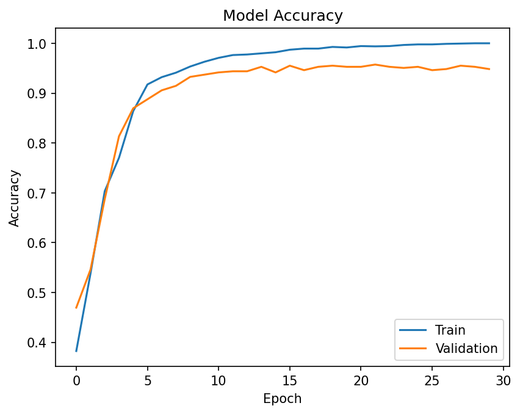
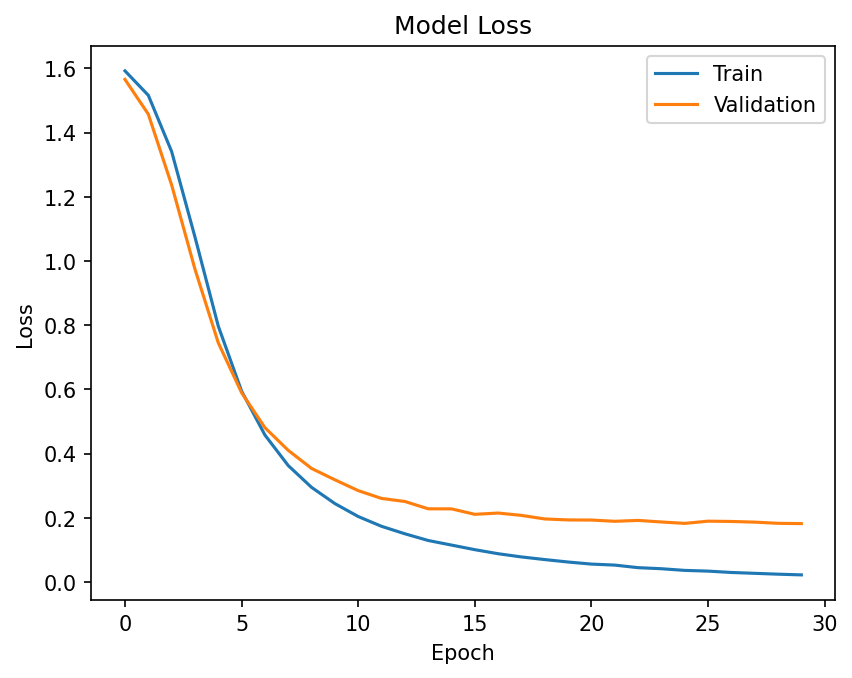
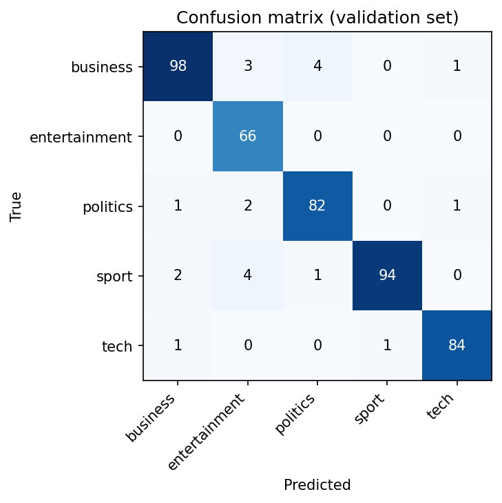
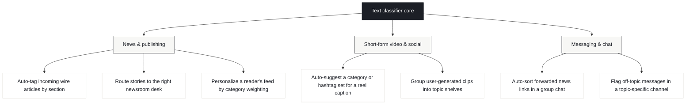

<div align="center">

# BBC News Classifier

**A neural network that reads a news article and tells you what it's about — instantly.**

[](https://bbc-news-classifier-nlp.streamlit.app/)
[](https://www.python.org/)
[](https://www.tensorflow.org/)
[](#license)

**[Try it live →](https://bbc-news-classifier-nlp.streamlit.app/)**

</div>

---

## What it does

Paste any English news article and the model classifies it into one of five
categories — **Business**, **Entertainment**, **Politics**, **Sport**, or
**Tech** — with a confidence score, in under a second. No API keys, no
sign-up, no setup. [Open the live app](https://bbc-news-classifier-nlp.streamlit.app/)
and try it on a real headline right now.

<div align="center">

| Accuracy | Loss |
|---|---|
|  |  |

**~94.8% validation accuracy**



</div>

---

## How it works


A lightweight embedding network — no transformers, no GPU required — trained
on 2,225 labeled BBC articles. Small enough to retrain in under a minute,
accurate enough to use in production for well-defined categories.

---

## Where this is actually useful

This isn't just a classroom exercise — the underlying primitive (map text to
a category, instantly, cheaply) is the backbone of several real products.



**News & publishing platforms.** The most direct fit — this is exactly the
kind of classifier a news aggregator or CMS uses to auto-tag incoming
articles by section instead of relying on manual tagging, or to route a
story to the right editorial desk before a human ever touches it.

**Short-form video & social apps.** Applied to a caption, transcript, or
auto-generated subtitle rather than the video itself, the same architecture
can suggest a topic for a clip — useful for organizing a content library or
powering topic-based recommendations on a reels-style feed.

**Chat & messaging products.** Applied to forwarded links or long text
messages, a classifier like this can auto-sort or auto-label content inside
a group chat — for example, flagging a message as Sport-related in a chat
that's mostly about Politics, or auto-archiving news links by topic.

> **Before reusing this exact model:** it was trained only on English,
> article-length BBC text. Arabic content, captions, or chat messages would
> need a retrained model on in-domain, in-language data — the architecture
> transfers directly, the trained weights do not.

---

## Project structure

```
bbc-news-classifier/
├── app.py                     Streamlit app (deployable entry point)
├── requirements.txt
├── data/
│   └── bbc-text.csv           BBC News dataset, 2,225 articles
├── models/                    Trained artifacts loaded by app.py
│   ├── bbc_news_model.keras
│   ├── tokenizer.pkl
│   └── label_tokenizer.pkl
├── src/                       Reusable training / inference code
│   ├── config.py              All hyperparameters and paths
│   ├── data_preprocessing.py  Loading, cleaning, tokenizing, label encoding
│   ├── model.py                Model architecture
│   ├── train.py                 python -m src.train — trains & saves everything
│   └── predict.py               Shared inference helper used by app.py
├── notebooks/
│   └── BBC_NEWS.ipynb         Exploration notebook using the src/ modules
└── assets/                    Training curve plots referenced above
```

---

## Getting started

```bash
git clone https://github.com/muhammed-alaa74/bbc-news-classifier.git
cd bbc-news-classifier
python -m pip install -r requirements.txt
python -m streamlit run app.py
```

The app opens at `http://localhost:8501`.

**Retrain from scratch:**

```bash
python -m src.train
```

Rebuilds the tokenizer and label encoder, trains the model, and overwrites
the artifacts in `models/` plus the plots in `assets/`.

---

## Deployment

**Live now:** [bbc-news-classifier-nlp.streamlit.app](https://bbc-news-classifier-nlp.streamlit.app/) — deployed on Streamlit Community Cloud.

To deploy your own copy:

1. Push this repository to GitHub.
2. Go to [share.streamlit.io](https://share.streamlit.io) and sign in with GitHub.
3. Click **New app**, select this repo/branch, set **Main file path** to `app.py`.
4. Click **Deploy**.

<details>
<summary>Docker (alternative deployment)</summary>

```dockerfile
FROM python:3.11-slim
WORKDIR /app
COPY . .
RUN pip install --no-cache-dir -r requirements.txt
EXPOSE 8501
CMD ["streamlit", "run", "app.py", "--server.port=8501", "--server.address=0.0.0.0"]
```

</details>

---

## Dataset

[BBC News dataset](https://raw.githubusercontent.com/PacktPublishing/Python-Natural-Language-Processing-Cookbook-Second-Edition/main/data/bbc-text.csv) —
2,225 articles across 5 categories, from the Python Natural Language
Processing Cookbook companion repository.

## License

MIT — see [LICENSE](LICENSE).

---

<div align="center">

**[Try the live demo →](https://bbc-news-classifier-nlp.streamlit.app/)**

</div>
